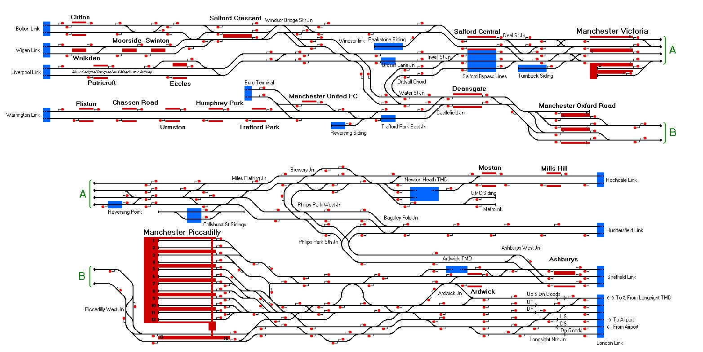

# Manchester-Area
A simulation of the railways in and around Manchester UK in 2024

## Current Status

| Stage         | Status        |
| ------------- |:-------------:|
| Track Plan     | :heavy_check_mark: |
| Signalling      | :heavy_check_mark: |
| Naming | :heavy_check_mark: |
| Speed Limits | :heavy_check_mark: |
| Distances | :heavy_check_mark: |
| Preferred Directions | :heavy_check_mark: |
| Timetable |  :heavy_check_mark: |
| Documentation |  :heavy_check_mark: |

## Data Sources

- [TRAKSY.UK](https://traksy.uk/)
- [RealTimeTrains](https://www.realtimetrains.co.uk/search/detailed)
- [Open Train Times](https://www.opentraintimes.com/maps)
- [OpenRailwayMap](https://www.openrailwaymap.org/)
- [Network Rail North Western (North) Sectional Appendix](https://www.networkrail.co.uk/industry-and-commercial/information-for-operators/national-electronic-sectional-appendix/)

Status icons by Freepik, pixelmeetup, Pixel Perfect on FlatIcon.com.